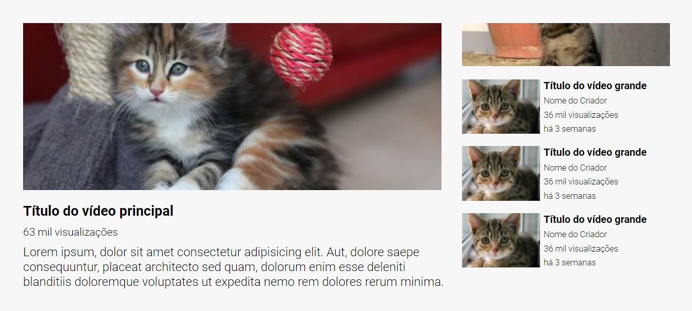

# Layout YouTube

Essa é a solução da realização de um Layout do YouTube proposto pelo curso DevQuest.

## Desafio

Criar uma interface de vídeos similiar ao Youtube, para ser aprimorado as habilidades de posicionamento de elementos usando grid e  flexbox.

## Screenshots

Versão para desktop

## Tecnologias utilizadas

- HTML
- CSS
- Grid
- Flexbox

